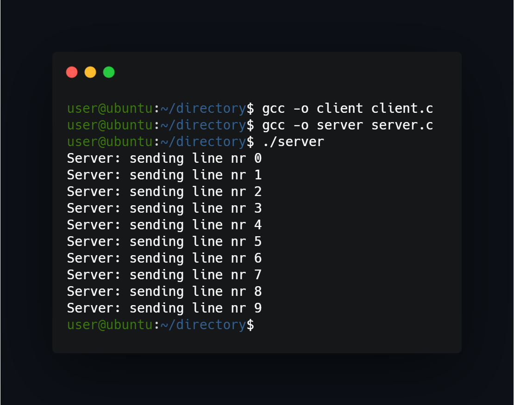
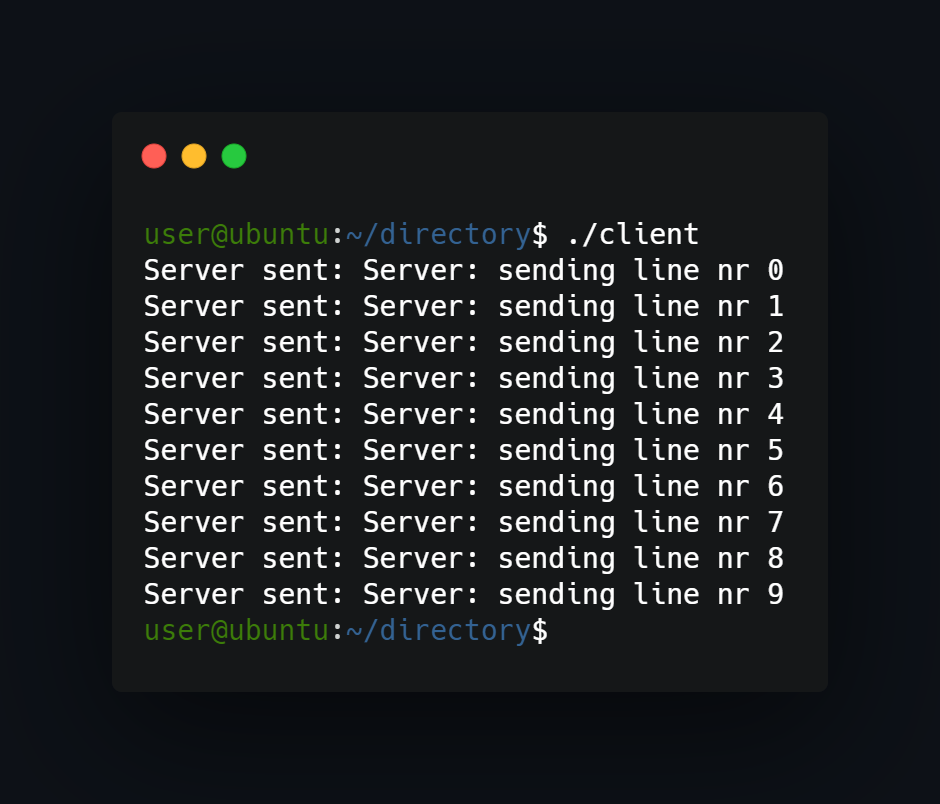

## What project do?
Programs act like server and client that communicate through popen method (using unnamed pipes).




## How to use?
Just compile and run:
```
gcc -o client client.c
gcc -o server server.c
./server
```
Then in other terminal use:
```
./client
```

<!--https://banner.godori.dev/ height:150-->
<!--https://shields.io/-->
<!--https://carbon.now.sh/-->